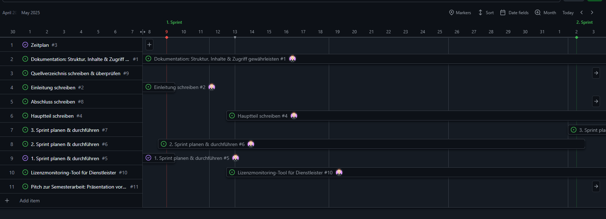

# Zeitplan

Um meine Semesterarbeit strukturiert voranzutreiben, habe ich zwei unterschiedliche Zeitpläne erstellt. Diese Zeitpläne variieren in ihrer Detailtiefe und bieten mir somit verschiedene Ansätze zur Organisation meiner Arbeit.

Dies ist der grobe Zeitplan, welchen ich aus dem [Einreichungsformular](../../ressources/docs/ITCNE24_Semesterarbeit_3_Einreichungsformular_Miguel_Schneider.pdf) entnommen habe. 

| Datum     | Aktivität                                                                 | Wer                        | Empfänger           |
|-----------|---------------------------------------------------------------------------|----------------------------|---------------------|
| 26.03.25  | Ablauf Semesterarbeiten und Liste mit Projektthemen vorstellen           | Lehrgangsleitung           | Studierende         |
| 16.04.25  | Abgabe Einreichungsformular                                              | Studierende                | Expert/innen        |
| 05.05.25  | Freigabe Semesterarbeit durch Expert/innen                               | Expert/innen               | Studierende         |
| 05.05.25  | Beginn Umsetzung Semesterarbeit                                          | Studierende                | Expert/innen        |
| 09.05.25  | 1. Sprint, evtl. mit Besprechung                                         | Studierende                | Expert/innen        |
| 02.06.25  | 2. Sprint, evtl. mit Besprechung                                         | Studierende                | Expert/innen        |
| 20.06.25  | 3. Sprint, evtl. mit Besprechung                                         | Studierende                | Expert/innen        |
| 09.07.25  | Abgabe der Arbeit / Abnahme mit Schlusspräsentation                      | Studierende                | Expert/innen        |
| 18.07.25  | Notenvorschlag                                                           | Projekt-Experte/in         | Lehrgangsleitung    |
| 25.07.25  | Mitteilung der Noten mit individuellem Feedback zur Einsicht hochladen  | Projekt-Experte/in         | Studierende         |
| 11.08.25  | Mitteilung der Noten                                                     | Lehrgangsleitung / Sekretariat | Studierende     |

Den genaueren Zeitplan habe ich im Projektmanagement in Github erstellt. 
Dies ist ein Kanban-Board, auf dem ich die Einzelnen Tasks und verschiedene Buckets habe. 
Mit diesem Board, kann ich auch eine Zeitplan-Achse abbilden, wo ich die Dauer eines Tasks definieren kann. 

Den Zeitplan in GitHub Project, kannst du unter diesem Link finden: <a href="https://github.com/users/Radball-Migi/projects/6" target="_blank">Github Project</a>

Mit GitHub Project, gibt es die Möglichkeit, die einzelnen Schritte in einer Roadmap anzuzeigen. 
Dies sieht dann in etwa so aus:

[*Roadmap in GitHub Projects*](https://github.com/users/Radball-Migi/projects/6/views/4)

Der Vorteil dabei ist, dass ich eine graphisch übersichtliche Zeitplanung habe, in der ich Visuell meine Tasks sehe (Balken mit dem Status des Issues), inklusive meinen Meilensteinen (Grüne Linie auf dem Zeitstrahl). 