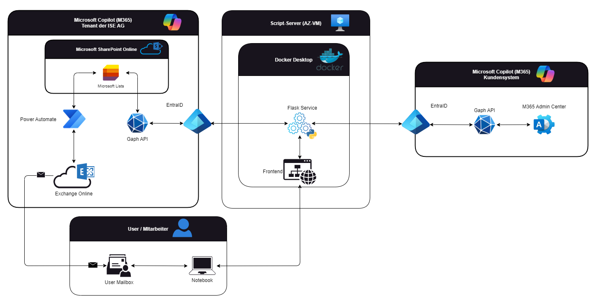

# SEUSAG

Mit der SEUSAG möchte ich die Systemgrenzen aufzeigen, welche bei meinem Projekt auftreten.

[*SEUSAG des Projektes* (Falls Bild nicht richtig angezeigt wird.)](../../ressources/images/SEUSAG.png)

## Microsoft Copilot (M365) – Tenant der ISE AG

- **Microsoft Lists (SharePoint Online)** als zentrales Datenrepository  
- **Power Automate** überwacht Lizenzdaten und versendet bei Schwellenwerten automatische E-Mails über **Exchange Online**  
- Zugriff und Authentifizierung erfolgen über **Graph API** und **EntraID**

## Script-Server (VM)

- Docker-basierter **Flask-Microservice**, der regelmäßig Lizenzdaten aus Kundensystemen über die Microsoft Graph API abruft  
- Stellt eine **API** für das Web-Frontend bereit  
- Verarbeitet und überträgt die Daten an Microsoft Lists (**Microsoft Copilot (M365) - Tenant der ISE AG**)

## Microsoft Copilot (M365) – Kundensystem

- Zugriff auf Lizenzinformationen über die **Graph API**  
- Authentifizierung via **EntraID**  
- Verwaltung über das **M365 Admin Center**

## User / Mitarbeitende

- Zugriff auf das **Frontend** vom Notebook  
- Übersichtliche Darstellung der Lizenzsituation  
- Empfang von **Benachrichtigungen** bei kritischen Lizenzständen über die persönliche **User Mailbox**
