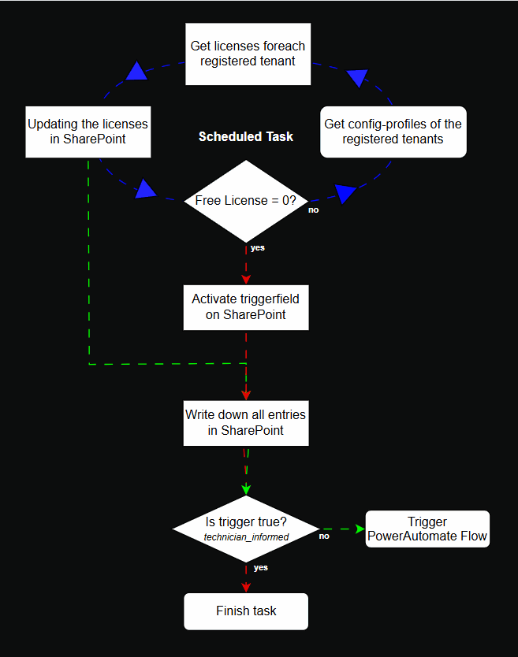

#  Verbessern (Improve) Phase

Die Improve-Phase ist der vierte Schritt in einem Six Sigma Projekt. In dieser Phase werden die in der [Analyze-Phase](./33_analysieren.md) identifizierten Hauptursachen für Prozessabweichungen adressiert und Lösungen entwickelt, um diese zu beheben. Ziel ist es, durch gezielte Verbesserungsmassnahmen die Prozessleistung zu optimieren und die identifizierten Probleme nachhaltig zu lösen. Dies umfasst die Anwendung von Kreativitätstechniken, statistischen Methoden und Pilotprojekten, um die Wirksamkeit der vorgeschlagenen Lösungen zu testen und zu validieren.


[Quelle](../Quellverzeichnis/index.md#improve-phase)

## Was ist MSVC?
MSVC, oder Microservices, ist ein Architekturstil für die Entwicklung von Anwendungen, bei dem eine Anwendung in eine Sammlung von kleinen, unabhängigen, und lose gekoppelten Diensten aufgeteilt wird. Jeder dieser Dienste, oder Microservices, hat seine eigene Codebasis und kann unabhängig voneinander entwickelt, bereitgestellt und skaliert werden.

### Was ist Flask API? 
Flask API ist ein leichtgewichtiges REST-Framework auf Basis von Python, das zur Implementierung von stateless Webservices genutzt wird. Es unterstützt HTTP-Methoden, JSON-Serialisierung und Middleware-Integration. Als Microservice fungiert es als Endpoint zur Datenverarbeitung oder Systemintegration.


## Umsetzung (Improve)

Wie in den vorherigen Schritten beschrieben, möchte ich einen Microservice erstellen, welcher von diversen Tenants den aktuellen Lizenzstand abfragt und im Falle dass keine Lizenz mehr übrig ist, sollte der Supporttechniker informiert werden, damit der Bestellprozess gestartet werden kann. 

Eine Umsetzung ist mir gelungen, wie ich Sie beschrieben habe. 
Als Endprodukt habe ich einen Microservice, welcher mittels FlaskAPI und dessen Templates ein Frontend anzeigen. Zusätzlich habe ich eine Integration im SharePoint, in der ich die Daten aus der Abfrage, in eine SharePoint Liste schreibe. Wenn die freien Lizenzen bei 0 stehen, dann wird mittels PowerAutomate ein Flow gestartet, welcher dies dem Supporttechniker meldet. 

Das *Know-how* habe ich mir durch meine aktive Teilnahme am MSVC-Unterricht bei Boris Langert sowie durch die YouTube-Tutorials  <a href="https://www.youtube.com/watch?v=QXeEoD0pB3E&list=PLsyeobzWxl7poL9JTVyndKe62ieoN-MZ3" target="_blank">Python for Beginners | Telusko</a> von <a href="https://www.youtube.com/@Telusko" target="_blank">Telusko</a>. 

> [!warning]
> Die gesammte Umsetzung wird nur in einer lokalen Dockerumgebung aufgebaut. Da diese Semesterarbeit später auch in einer Produktiven umgebung in den Einsatz kommen kann, soll diese zuerst lokal funktionieren. 
> Zusätzlich, wäre die Produktivumgebung später auch auf einem Server und würde durch Dockerdesktop betrieben/gehostet werden. Dieser Server ist aber nur durch das interne Netzwerk der Firma erreichbar
> Somit ist das Szenario, lokal auf dem eigenen Notebook realistisch und fast 1:1 das gleiche.
> 
> Ein weiterer Punkt ist der Datenschutz. 
> Da wir diverse Daten zu den jeweiligen Tenants in diesem Service haben, darf das ganze nicht in die Cloud. (genaueres folgt später)
> 
> Als erster Aufbau werden zwei Testtenants der ISE AG verwendet. Diese Simulieren dann alle Tenants, welche später ggf. gemonitort werden. 

### Grundgerüst des Microservices

Zu beginn habe ich mit der App begonnen, dort habe ich mit der Vorlage aus dem Unterricht begonnen und auf dieser Aufgebaut. 
Da wir im Unterricht immer wieder ergänzugen gemacht haben, habe ich eigentlich von 0 begonnen und bis zum schritt alles vorbereitet, bis ich dort angelangt bin, bis dahin, wo ich auf der App aufbauen möchte. 

Die Struktur war schlicht und nur gerade das nötigste. 
- Docker / Compose Files
- Blueprint implementiert
- SQLite DB

Filestruktur mit dem Grundgerüst

Mit dieser Struktur, konnte bereits mittels ersten simulativen API Calls getestet werden, jedoch nur mit Einträgen, welche von Hand in die DB gemacht wurden. 


> Zu beginn wird die Datenbank zu testzwecken verwendet, um sicher zu sein, dass die API Calls funktionieren

#### Angaben zum Microsoervice

Technologie: FlaskAPI
Scriptsprache: Python
Endpunkt: http://localhost:5000/api/v1
Swagger-UI: http://localhost:5000/api/v1/docs


Zusätzlich wurde auch ein Swagger eingerichtet, um die einzelnen Routen zu dokumentieren.
Der Swagger ist unter folgender URL zu erreichen (Nur wenn der Docker-Container aktiv ist)
[Lizenztool-Swagger-UI](http://localhost:5000/api/v1/docs)


### Grundgerüst des Microservices

Die Entwicklung des Lizenzüberwachungstools begann mit einem einfachen Grundgerüst, basierend auf der im Unterricht vermittelten Vorlage. Im Verlauf des Semesters wurde die Vorlage stetig erweitert. Da die Unterrichtseinheiten immer wieder neue Bausteine ergänzten, entschloss ich mich dazu, die App vollständig neu aufzubauen – modular, testbar und Docker-kompatibel.

Das initiale Setup konzentrierte sich auf eine schlanke, aber funktionale Struktur:

- **Docker-/Compose-Files** zur Containerisierung und einfachen Bereitstellung
- **Blueprints** zur sauberen Trennung von Funktionen und Routen
- **SQLite** als leichtgewichtiges Datenbanksystem für die Entwicklungsphase

#### 📂 Projektstruktur

```text
licensetool
├── app
│   ├── licenses
│   │    ├── __init.py
│   │    └── routes.py
│   ├── main
│   │    ├── __init.py
│   │    └── routes.py
│   ├── models
│   │    └── license.py
│   ├── __init__.py
│   └── extensions.py
├── app.db
├── compose.test.yaml
├── compose.yaml
├── config.py
├── dockerfile
├── dockerfile.test
└── requirements.txt
```

> _Die Struktur wurde so gewählt, dass spätere Erweiterungen (z. B. neue Blueprints oder externe Services) problemlos integriert werden können._

Bereits mit diesem Setup war es möglich, erste **simulative API-Calls** durchzuführen. In der Anfangsphase wurden Testdaten manuell in die Datenbank eingetragen, um die korrekte Funktion der API-Endpunkte zu validieren.

>[! info]
>Die SQLite-Datenbank dient in der Entwicklungsphase primär zu Testzwecken.

#### Technische Eckdaten des Microservices

| Komponente       | Beschreibung                        |
| ---------------- | ----------------------------------- |
| **Technologie**  | Flask (Flask-RESTful)               |
| **Module**       | FlaskAPI                            |
| **Sprache**      | Python                              |
| **API-Endpunkt** | `http://localhost:5000/api/v1`      |
| **Swagger UI**   | `http://localhost:5000/api/v1/docs` |

Zusätzlich wurde ein **Swagger-Dokumentationsinterface** eingerichtet, um alle API-Routen übersichtlich darzustellen. Dies erleichtert nicht nur die Entwicklung, sondern auch die spätere Integration in andere Systeme.

👉 [Lizenztool Swagger UI (lokal)](http://localhost:5000/api/v1/docs) _(nur aktiv bei laufendem Docker-Container)_


### Erweiterung: Lizenzabfrage bei anderen Tenants (via Microsoft Graph)

Da nun das Grundgerüst steht und die API abfragen auf die Datenbank funktionieren, schauen wir nun, wie wir die Lizenzdaten in die Datenbank hinzufügen können. 

Da es sich bei diesen Tenants um Microsoft-Tenants handelt, ist es eigentlich fast klar, das wir die daten via Microsoft Graph (MGGraph oder auch Graph) auslesen müssen. 

Eine Connection mit Microsoft Graph, hatte ich bereits über ein anderes Projekt, an dem ich diese Funktion geschrieben habe. Deshalb habe ich zu beginn auch dieses verwendet. Das Rad müssen wir ja nicht neu erfinden, wenn es bereits vorhanden ist, nur das vorhandene verbessern ;)

Bei der ersten Version der funktion, waren die Logindaten hardcoded im Code. 
Für eine dynamische Struktur und den geplanten Einsatz, ist dies sehr suboptimal, da wir die Logins auch schützen möchten. Somit habe ich mich bei uns einmal umgeschaut und wir arbeiten in vielen Apps und auch Scripts mit Config-Profiles, welche JSON-Files sind, welche alle Informationen enthalten. Ein weiterer Vorteil dieser Config-Profiles ist dass wir dort zentrall alle Angaben zu einen Tenant oder Aufgabe mitgeben können, indem wir dies dort einfach hinterlegen. 
Da die Zertifikate für die App-Registrierung (folgt später) nur 1 Jahr gültig ist, muss dies immer wieder erneuert werden (Sicherheitsgründe). So muss man nur das Config-Profile anpassen und nicht im Script rumsuchen.

```json
{
    "tenant_id": "<tenantid>",
    "tenant_name": "tenantname",
    "client_id": "<clientid>",
    "thumbprint": "<thumbprint>",
    "cert_path": "certs/<tenantname>/mycert_<tenantname>.pem",
    "expires": "2026-05-19"
}
```

*Beispiel eines config-profiles*


### Funktionsablauf des MSVC



**Ablaufdiagramm der App**
- **Blauer Zyklus**: Der Scheduled Task ruft periodisch den Lizenzstatus ab.
- **Grüner Pfad**: Lizenzen verfügbar – Daten werden dokumentiert.
- **Roter Pfad**: Lizenzen = 0 – PowerAutomate wird getriggert.


## Datenschutz in diesem Microservice

Wie bereits in der Hinweisbox zu Beginn erwähnt, wird dieser Microservice **lokal in einem Docker-Container auf Docker Desktop** betrieben. Der Grund dafür ist der Schutz von Personendaten gemäss dem **revidierten Datenschutzgesetz (revDSG, SR 235.1)**. Eine Cloud-Verarbeitung wird vermieden, da die bearbeiteten Daten potenziell besonders schützenswert sein können und Risiken durch externe Verarbeitung reduziert werden sollen.

Gemäss **Artikel 7 revDSG** (_Datenschutz durch Technik und datenschutzfreundliche Voreinstellungen_) gilt:

> _„Der Verantwortliche trifft bereits bei der Planung der Bearbeitung sowie bei der Bearbeitung selbst geeignete technische und organisatorische Massnahmen, um die Datenschutzvorschriften einzuhalten, insbesondere die Grundsätze nach Artikel 6.“_

Obwohl der Zugriff über eine **Microsoft-Authentifizierung** abgesichert ist, besteht dennoch ein Restrisiko, dass Benutzerkonten kompromittiert werden könnten. Dies betrifft die Anforderungen zur **Datensicherheit** nach **Artikel 8 revDSG** (_Datensicherheit_), wo es heisst:

> _„Personendaten müssen durch geeignete technische und organisatorische Massnahmen gegen unbefugtes Bearbeiten geschützt werden.“_

### Sensitive Daten

Im Tool ist ersichtlich, welcher Tenant über welche und wie viele Microsoft-Lizenzen verfügt. Anhand dieser Lizenzinformationen – z. B. Lehrer- und Schülerlizenzen an einer Schule – lassen sich Rückschlüsse auf die Anzahl und Zusammensetzung der Benutzergruppen ziehen. Gemäss **Artikel 5 lit. a revDSG** sind Personendaten definiert als:

> _„alle Angaben, die sich auf eine bestimmte oder bestimmbare natürliche Person beziehen“._

Da bei Schul- oder KMU-Installationen oft klar ist, welche Gruppen (Lehrpersonen, Lernende, Mitarbeitende) mit welchen Lizenzen arbeiten, können diese Angaben als **bestimmbare Personendaten** gelten.

Zudem kann durch Premiumlizenzen indirekt erkannt werden, welche Tools oder Dienste verwendet werden. Diese Informationen erlauben möglicherweise Rückschlüsse auf interne Organisation oder Geschäftsstrategien. Je nach Kontext könnten solche Angaben unter die **besonders schützenswerten Personendaten** gemäss **Artikel 5 lit. c revDSG** fallen, insbesondere wenn sie Rückschlüsse auf berufliche Tätigkeiten, Gruppenzugehörigkeit oder Verhaltensmuster erlauben.

### Kurzgesagt:
Aus Datenschutzgründen wird der Microservice lokal im Docker-Container betrieben und nicht in der Cloud gehostet. Obwohl Microsoft Authentication verwendet wird, besteht bei kompromittierten Konten ein Restrisiko. Das Tool zeigt sensible Informationen wie Tenant-Daten, Lizenztypen und -anzahl. Daraus lassen sich Rückschlüsse auf Nutzergruppen (z. B. Schüler, Lehrpersonen) und eingesetzte Dienste ziehen – was datenschutzrechtlich heikel sein kann.