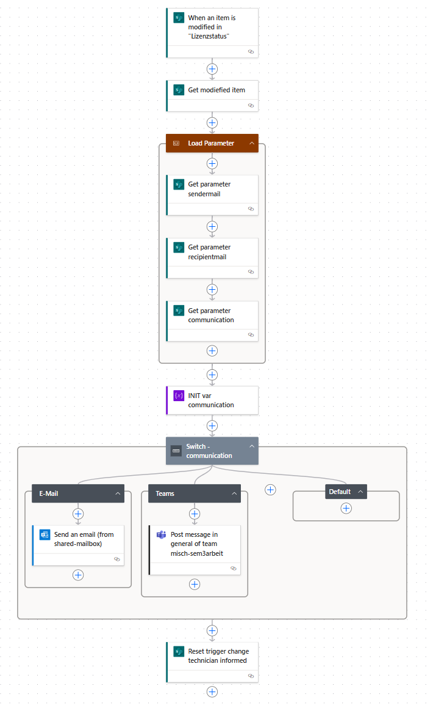
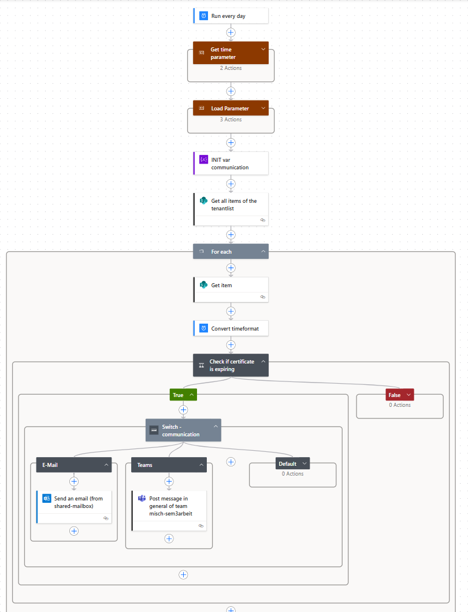

#  Verbessern (Improve) Phase

Die Improve-Phase ist der vierte Schritt in einem Six Sigma Projekt. In dieser Phase werden die in der [Analyze-Phase](./33_analysieren.md) identifizierten Hauptursachen für Prozessabweichungen adressiert und Lösungen entwickelt, um diese zu beheben. Ziel ist es, durch gezielte Verbesserungsmassnahmen die Prozessleistung zu optimieren und die identifizierten Probleme nachhaltig zu lösen. Dies umfasst die Anwendung von Kreativitätstechniken, statistischen Methoden und Pilotprojekten, um die Wirksamkeit der vorgeschlagenen Lösungen zu testen und zu validieren.


[Quelle](../Quellverzeichnis/index.md#improve-phase)

## Was ist MSVC?
MSVC, oder Microservices, ist ein Architekturstil für die Entwicklung von Anwendungen, bei dem eine Anwendung in eine Sammlung von kleinen, unabhängigen, und lose gekoppelten Diensten aufgeteilt wird. Jeder dieser Dienste, oder Microservices, hat seine eigene Codebasis und kann unabhängig voneinander entwickelt, bereitgestellt und skaliert werden.

### Was ist Flask API? 
Flask API ist ein leichtgewichtiges REST-Framework auf Basis von Python, das zur Implementierung von stateless Webservices genutzt wird. Es unterstützt HTTP-Methoden, JSON-Serialisierung und Middleware-Integration. Als Microservice fungiert es als Endpoint zur Datenverarbeitung oder Systemintegration.


## Umsetzung (Improve)

Wie in den vorherigen Schritten beschrieben, möchte ich einen Microservice erstellen, welcher von diversen Tenants den aktuellen Lizenzstand abfragt und im Falle dass keine Lizenz mehr übrig ist, sollte der Supporttechniker informiert werden, damit der Bestellprozess gestartet werden kann. 

Eine Umsetzung ist mir gelungen, wie ich Sie beschrieben habe. 
Als Endprodukt habe ich einen Microservice, welcher mittels FlaskAPI und dessen Templates ein Frontend anzeigen. Zusätzlich habe ich eine Integration im SharePoint, in der ich die Daten aus der Abfrage, in eine SharePoint Liste schreibe. Wenn die freien Lizenzen bei 0 stehen, dann wird mittels PowerAutomate ein Flow gestartet, welcher dies dem Supporttechniker meldet. 

Das *Know-how* habe ich mir durch meine aktive Teilnahme am MSVC-Unterricht bei Boris Langert sowie durch die YouTube-Tutorials  <a href="https://www.youtube.com/watch?v=QXeEoD0pB3E&list=PLsyeobzWxl7poL9JTVyndKe62ieoN-MZ3" target="_blank">Python for Beginners | Telusko</a> von <a href="https://www.youtube.com/@Telusko" target="_blank">Telusko</a>. 

> ⚠️ **Wichtig**<br>
> Die gesammte Umsetzung wird nur in einer lokalen Dockerumgebung aufgebaut. Da diese Semesterarbeit später auch in einer Produktiven umgebung in den Einsatz kommen kann, soll diese zuerst lokal funktionieren. 
> Zusätzlich, wäre die Produktivumgebung später auch auf einem Server und würde durch Dockerdesktop betrieben/gehostet werden. Dieser Server ist aber nur durch das interne Netzwerk der Firma erreichbar
> Somit ist das Szenario, lokal auf dem eigenen Notebook realistisch und fast 1:1 das gleiche.
> 
> Ein weiterer Punkt ist der Datenschutz. 
> Da wir diverse Daten zu den jeweiligen Tenants in diesem Service haben, darf das ganze nicht in die Cloud. (genaueres folgt später)
> 
> Als erster Aufbau werden zwei Testtenants der ISE AG verwendet. Diese Simulieren dann alle Tenants, welche später ggf. gemonitort werden. 

### Grundgerüst des Microservices 

Zu beginn habe ich mit der App begonnen, dort habe ich mit der Vorlage aus dem Unterricht begonnen und auf dieser Aufgebaut. 
Da wir im Unterricht immer wieder ergänzugen gemacht haben, habe ich eigentlich von 0 begonnen und bis zum schritt alles vorbereitet, bis ich dort angelangt bin, bis dahin, wo ich auf der App aufbauen möchte. 

Die Struktur war schlicht und nur gerade das nötigste. 
- Docker / Compose Files
- Blueprint implementiert
- SQLite DB

Filestruktur mit dem Grundgerüst

Mit dieser Struktur, konnte bereits mittels ersten simulativen API Calls getestet werden, jedoch nur mit Einträgen, welche von Hand in die DB gemacht wurden. 


> Zu beginn wird die Datenbank zu testzwecken verwendet, um sicher zu sein, dass die API Calls funktionieren

#### Angaben zum Microsoervice

Technologie: FlaskAPI <br>
Scriptsprache: Python <br>
Endpunkt: http://localhost:5000/api/v1 <br>
Swagger-UI: http://localhost:5000/api/v1/docs <br>


Zusätzlich wurde auch ein Swagger eingerichtet, um die einzelnen Routen zu dokumentieren.
Der Swagger ist unter folgender URL zu erreichen (Nur wenn der Docker-Container aktiv ist)
[Lizenztool-Swagger-UI](http://localhost:5000/api/v1/docs)


### Grundgerüst des Microservices

Die Entwicklung des Lizenzüberwachungstools begann mit einem einfachen Grundgerüst, basierend auf der im Unterricht vermittelten Vorlage. Im Verlauf des Semesters wurde die Vorlage stetig erweitert. Da die Unterrichtseinheiten immer wieder neue Bausteine ergänzten, entschloss ich mich dazu, die App vollständig neu aufzubauen – modular, testbar und Docker-kompatibel.

Das initiale Setup konzentrierte sich auf eine schlanke, aber funktionale Struktur:

- **Docker-/Compose-Files** zur Containerisierung und einfachen Bereitstellung
- **Blueprints** zur sauberen Trennung von Funktionen und Routen
- **SQLite** als leichtgewichtiges Datenbanksystem für die Entwicklungsphase

#### Projektstruktur

```text
licensetool
├── app
│   ├── licenses
│   │    ├── __init.py
│   │    └── routes.py
│   ├── main
│   │    ├── __init.py
│   │    └── routes.py
│   ├── models
│   │    └── license.py
│   ├── __init__.py
│   └── extensions.py
├── app.db
├── compose.test.yaml
├── compose.yaml
├── config.py
├── dockerfile
├── dockerfile.test
└── requirements.txt
```

> _Die Struktur wurde so gewählt, dass spätere Erweiterungen (z. B. neue Blueprints oder externe Services) problemlos integriert werden können._

Bereits mit diesem Setup war es möglich, erste **simulative API-Calls** durchzuführen. In der Anfangsphase wurden Testdaten manuell in die Datenbank eingetragen, um die korrekte Funktion der API-Endpunkte zu validieren.

> ℹ️ **Information** <br>
>Die SQLite-Datenbank dient in der Entwicklungsphase primär zu Testzwecken.

#### Technische Eckdaten des Microservices

| Komponente       | Beschreibung                        |
| ---------------- | ----------------------------------- |
| **Technologie**  | Flask (Flask-RESTful)               |
| **Module**       | FlaskAPI                            |
| **Sprache**      | Python                              |
| **API-Endpunkt** | `http://localhost:5000/api/v1`      |
| **Swagger UI**   | `http://localhost:5000/api/v1/docs` |


Zusätzlich wurde ein **Swagger-Dokumentationsinterface** eingerichtet, um alle API-Routen übersichtlich darzustellen. Dies erleichtert nicht nur die Entwicklung, sondern auch die spätere Integration in andere Systeme.

👉 [Lizenztool Swagger UI (lokal)](http://localhost:5000/api/v1/docs) *(nur aktiv bei laufendem Docker-Container)*


### Implementierung: Lizenzabfrage bei anderen Tenants (via Microsoft Graph)

Nachdem das Grundgerüst des Microservices steht und die ersten API-Tests erfolgreich durchgeführt wurden, ging es im nächsten Schritt darum, **die Lizenzdaten automatisiert für verschiedene Microsoft-Tenants abzufragen** und für die spätere Weiterverarbeitung (z. B. Speicherung oder Eskalation) bereitzustellen.

Da es sich bei den zu überwachenden Tenants um Microsoft-365-Umgebungen handelt, bot sich die **Microsoft Graph API** als zentrale Schnittstelle an. Ich konnte hierfür auf bestehende Erfahrungen zurückgreifen, da ich eine ähnliche Funktion bereits in einem anderen Projekt implementiert hatte.

#### Sicherheit durch Config-Profile

In der ersten Version waren die Authentifizierungsdaten fest im Code hinterlegt – das war aus Sicherheits- und Wartungsgründen jedoch nicht ideal. Für die produktionsnahe Umsetzung habe ich mich deshalb für **dynamisch ladbare JSON-Konfigurationsprofile** entschieden. Diese enthalten alle nötigen Angaben (z. B. `tenant_id`, Zertifikatspfad, Ablaufdatum) und lassen sich bei Zertifikatserneuerung einfach austauschen.

> ℹ️ **Information** <br>
> Diese Abstraktion erlaubt eine saubere Trennung von Code und Konfiguration. Neue Tenants können künftig mit minimalem Aufwand eingebunden werden – es reicht ein neues Config-File und Zertifikat im jeweiligen Ordner.

##### Beispiel eines Config-Files:

```json
{
  "tenant_id": "<tenantid>",
  "tenant_name": "tenantname",
  "client_id": "<clientid>",
  "thumbprint": "<thumbprint>",
  "cert_path": "certs/<tenantname>/mycert_<tenantname>.pem",
  "expires": "2026-05-19"
}
```

#### Erweiterung der Struktur

Im Projekt wurden folgende Ordner ergänzt:

```text
licensetool
├── app
│   ├── modules
│   │   └── mggraph.py      # Graph-Modul zur Lizenzabfrage
├── certs
│   ├── *certfolder foreach tenant*
│   ├── *info folder foreach tenant*
│   └── certcreation.sh
├── config-profiles
│   └── *config-profile foreach tenant*
│...
```

### 📡 Lizenzabfrage via Microsoft Graph API

Die eigentliche Abfrage der Lizenzinformationen (`subscribedSkus`) erfolgt über das Modul [`mggraph.py`](https://github.com/Radball-Migi/HF-ITCNE24-SemArbeit3-MSVC-Lizenztool/tree/main/ressources/licensetool/app/modules/mggraph.py). Dort übernimmt die Klasse `GraphLicenseClient` die Authentifizierung sowie die API-Kommunikation.

```python
class GraphLicenseClient:
    def __init__(self, tenant_name: str):
        self.tenant_name = tenant_name
        self.config = self._load_config()
        self.token = self._authenticate()

    def _load_config(self):
        config_file = f"config-profiles/config-{self.tenant_name}-profile.json"
        with open(config_file, "r") as f:
            return json.load(f)

    def _authenticate(self):
        authority = f"https://login.microsoftonline.com/{self.config['tenant_id']}"
        app = ConfidentialClientApplication(
            client_id=self.config['client_id'],
            authority=authority,
            client_credential={
                "private_key": open(self.config['cert_path'], "r").read(),
                "thumbprint": self.config['thumbprint']
            }
        )
        result = app.acquire_token_for_client(scopes=["https://graph.microsoft.com/.default"])
        if "access_token" not in result:
            raise Exception(f"Token acquisition failed: {result.get('error_description')}")
        return result["access_token"]

    def get_license_status(self):
        headers = {"Authorization": f"Bearer {self.token}"}
        response = requests.get(
            "https://graph.microsoft.com/v1.0/subscribedSkus",
            headers=headers,
            timeout=10
        )
        if response.status_code != 200:
            raise Exception(f"Graph API error: {response.status_code} - {response.text}")
        return response.json()
```

### Beispielhafte API-Antwort

Die `get_license_status()`-Methode liefert eine strukturierte JSON-Antwort mit allen abonnierten Lizenzen des Tenants:

```json
[
  {
    "available_units": 20,
    "consumed_units": 19,
    "free_units": 1,
    "skuid": "94763226-9b3c-4e75-a931-5c89701abe66",
    "skupartnumber": "STANDARDWOFFPACK_FACULTY"
  },
  {
    "available_units": 1,
    "consumed_units": 1,
    "free_units": 0,
    "skuid": "0e142028-345e-45da-8d92-8bfd4093bbb9",
    "skupartnumber": "PHONESYSTEM_VIRTUALUSER_FACULTY"
  },
  {
    "available_units": 12,
    "consumed_units": 10,
    "free_units": 2,
    "skuid": "d979703c-028d-4de5-acbf-7955566b69b9",
    "skupartnumber": "MCOEV_FACULTY"
  },
  {
    "available_units": 2000,
    "consumed_units": 1500,
    "free_units": 500,
    "skuid": "314c4481-f395-4525-be8b-2ec4bb1e9d91",
    "skupartnumber": "STANDARDWOFFPACK_STUDENT"
  },
  {
    "available_units": 100000,
    "consumed_units": 7,
    "free_units": 99930,
    "skuid": "f30db892-07e9-47e9-837c-80727f46fd3d",
    "skupartnumber": "FLOW_FREE"
  }
]
```

> ℹ️ **Hinweis zu Daten und Datenschutz**  
> Die angezeigten Lizenzzahlen wurden zu Test- und Demonstrationszwecken **angepasst** und entsprechen **nicht den realen Werten** produktiver Microsoft-Tenants.  
> Zudem wurden sämtliche darstellbaren Informationen im Sinne des Datenschutzes **anonymisiert oder verfremdet**, um Rückschlüsse auf reale Kundendaten auszuschliessen.

Somit haben wir bereits einen wichtigen Schritt gemacht, indem wir die Lizenzen als JSON zurück erhalten.
Als nächstes, müssen wir die Daten aufwerten und bereitmachen für das Frontend. 

___


### Implementierung: Frontend zur Visualisierung der Lizenzdaten

Nachdem die Lizenzdaten erfolgreich über die Microsoft Graph API abgerufen und als JSON verarbeitet werden konnten, wurde im nächsten Schritt ein **benutzerfreundliches Frontend** entwickelt. Dieses dient allen Mitarbeitenden – unabhängig vom technischen Hintergrund – als zentrale Übersicht, um den aktuellen Lizenzstatus jederzeit auf einen Blick einsehen zu können.

Ziel war es, eine **intuitive und optisch ansprechende Oberfläche** bereitzustellen, die den aktuellen Zustand der Lizenzen klar darstellt, Filtermöglichkeiten bietet und potenzielle Engpässe direkt ersichtlich macht – ohne dass die Nutzer mit technischen Details wie API-Calls oder Datenbanken konfrontiert werden.

#### Verfügbare Ansichten im Frontend

Es wurden mehrere HTML-Seiten (Templates) implementiert, jeweils mit eigener CSS-Datei zur Gestaltung:

| Template-Datei    | Beschreibung                                                                                                             |
| ----------------- | ------------------------------------------------------------------------------------------------------------------------ |
| `statusall.html`  | Übersicht aller Lizenzen aus allen Tenants in einer zentralen Tabelle                                                    |
| `tenant.html`     | Einzelabfrage eines spezifischen Tenants (z. B. Detailansicht)                                                           |
| `mainpage.html`   | Startseite / Einstiegsseite ins Tool                                                                                     |
| `monitoring.html` | Verwaltungsansicht zur Steuerung ob ein Tenant aktiv ist oder ob Mitteilungen zu diesem Tenant versendet werden sollen.  |

```text
├── app
│   ├── static
│   │    ├── images
│   │	 │    └── frontend.css
│   │    ├── mainpage.css
│   │    ├── monitoring.css
│   │    ├── statusall.css
│   │    └── tenant.css
│   ├── templates
│   │    ├── mainpage.html
│   │    ├── monitoring.html
│   │    ├── statusall.html
│   │    └── tenant.html
│...
```

#### Routenbindung der Templates

Die Templates werden mit dem Flask-Modul `render_template()` in den jeweiligen Blueprints geladen.

```python
# Beispiel einer Template-Route 
@bp.get('/status/tenant')
def show_tenant():
    return render_template("tenant.html")
```

Ausschnitt aus [`app/licenses/routes.py`](https://github.com/Radball-Migi/HF-ITCNE24-SemArbeit3-MSVC-Lizenztool/blob/main/ressources/licensetool/app/licenses/routes.py)

#### Funktionen im Frontend

- **Tabellarische Darstellung** aller Lizenzdaten
- **Farbliche Hervorhebung** bei kritischem Lizenzstand
- **Such- und Filterfunktionen** über JavaScript
- **Anbindung an API-Endpoint** über `fetch()` zur Anzeige der aktuellen Daten
- **Trennung von HTML, CSS und Logik (JavaScript)** für bessere Wartbarkeit

#### Beispielhafte HTML-/JS-Integration (`statusall.html`)

```html
<input type="text" id="filterInput" placeholder="z. B. ISE School">
...
<table id="licenseTable">
  <thead>
    <tr>
      <th>Tenant</th>
      <th>SKU Part Number</th>
      <th>SKU ID</th>
      <th>Verfügbar</th>
      <th>Verbraucht</th>
      <th>Frei</th>
    </tr>
  </thead>
  <tbody id="licenseBody">
    <!-- Dynamischer Inhalt -->
  </tbody>
</table>

<script>
  let fullData = [];

  function renderTable(data) {
    const tbody = document.getElementById('licenseBody');
    tbody.innerHTML = '';
    data.forEach(item => {
      const row = document.createElement('tr');
      if (item.free_units <= 0) row.classList.add('low-license');
      row.innerHTML = `
        <td>${item.tenant}</td>
        <td>${item.skupartnumber}</td>
        <td>${item.skuid}</td>
        <td>${item.available_units}</td>
        <td>${item.consumed_units}</td>
        <td>${item.free_units}</td>
      `;
      tbody.appendChild(row);
    });
  }

  fetch('/api/v1/licenses/status')
    .then(response => response.json())
    .then(data => {
      fullData = data;
      renderTable(fullData);
    });

  document.getElementById("filterInput").addEventListener("keyup", () => {
    const query = document.getElementById("filterInput").value.toLowerCase();
    const filtered = fullData.filter(item =>
      item.tenant.toLowerCase().includes(query) ||
      item.skupartnumber.toLowerCase().includes(query)
    );
    renderTable(filtered);
  });
</script>
```

#### Ziel des Frontends

Das Frontend schafft eine klare Benutzeroberfläche, in der Lizenzdaten:

- **tabellarisch dargestellt** werden
- durch **Farben oder Filter** visuell hervorgehoben sind
- gezielt nach Tenants oder Lizenztypen **gefiltert** werden können
- **aktuell** bleiben dank direkter API-Anbindung

Damit kann jede Person schnell erfassen, ob **Handlungsbedarf** besteht – z. B. vollständigem Verbrauch.

___ 

### Implementierung: SharePoint-Einbindung

Da in unserem Unternehmen intensiv mit **SharePoint** gearbeitet wird, war von Beginn an vorgesehen, die Lizenzdaten und Konfigurationen dort zentral zu verwalten. Der Microservice kommuniziert über die **Microsoft Graph API** mit SharePoint – sowohl zur Datenablage als auch zur Steuerung der Lizenzüberwachung.

Ein zusätzlicher Grund für die SharePoint-Einbindung liegt in der geplanten **Alarmierung bei Lizenzengpässen über PowerAutomate**, die auf Felder in den SharePoint-Listen reagiert. PowerAutomate wird an anderer Stelle genauer erklärt – an dieser Stelle reicht es zu wissen, dass der SharePoint auch dafür als Trigger dient.

Für den Zugriff wurde eine eigene App-Registrierung erstellt, welche ausschliesslich die Berechtigungen für den SharePoint-Zugriff besitzt.

```text
├── config-profiles
│   ├── sharepoint
│   │    └── sp-config-<name>-profile.json
```


#### Übersicht der SharePoint-Listen und Felder

##### Parameterliste – Systemweite Konfigurationswerte

|Feldname|Typ|Beschreibung|
|---|---|---|
|`Parameter`|Textfeld|Der technische Name des Parameters (z. B. Mail-Adresse)|
|`Parameterwert`|Textfeld|Der zugehörige Wert (z. B. support@iseag.ch)|

> Wird verwendet für globale Konfigurationswerte wie Empfänger, Absender, Kommunikationskanal etc.


##### Tenantliste – Steuerung der zu überwachenden Tenants

|Feldname|Typ|Beschreibung|
|---|---|---|
|`Title`|Textfeld|Anzeigename / Name des Tenants|
|`enabled`|Ja/Nein|Ob der Tenant aktiv überwacht werden soll|
|`monitoring`|Ja/Nein|Ob bei Lizenzmangel eine Alarmierung (PowerAutomate) ausgelöst werden soll|
|`cert_expires`|Datum|Ablaufdatum des hinterlegten App-Zertifikats|

> Diese Liste ist für das Aktivieren/Deaktivieren einzelner Tenants zuständig und wird bei jeder Abfrage vor der Datenverarbeitung geprüft.


##### Lizenzstatusliste – Aktuelle Lizenzwerte pro Tenant

|Feldname|Typ|Beschreibung|
|---|---|---|
|`Lizenzname`|Textfeld|Name/Bezeichnung der Lizenz (z. B. STANDARDWOFFPACK_STUDENT)|
|`Verfügbar`|Zahl|Anzahl insgesamt verfügbarer Lizenzen|
|`Gebraucht`|Zahl|Anzahl aktuell verwendeter Lizenzen|
|`Frei`|Zahl|Differenz zwischen Verfügbar und Gebraucht|
|`tenant`|Textfeld|Name des zugehörigen Tenants|
|`trigger_inform_supporter`|Ja/Nein|Wird bei 0 freien Lizenzen gesetzt, um den Flow via PowerAutomate zu starten|
|`technician_informed`|Ja/Nein|Gibt an, ob der Support bereits informiert wurde|

> Diese Liste ist der zentrale Datenspeicher des Lizenzstatus und dient zugleich als Triggerquelle für PowerAutomate.


##### Technische Umsetzung im Code

Die Aktualisierung bzw. Erstellung der SharePoint-Einträge erfolgt im Modul `mggraph.py` innerhalb der Funktion `push_license_status_to_sharepoint()`.

Für jede Lizenz wird geprüft, ob ein Eintrag bereits existiert. Falls ja, wird dieser **aktualisiert** – andernfalls **neu erstellt**. Die Entscheidung, ob das Feld `trigger_inform_supporter` gesetzt wird, basiert auf folgender Logik:

```python
if free == 0 and not technician_informed:
    sp_fields[field_mapping["Infosup"]] = True
if free > 0 and technician_informed:
    sp_fields["technician_informed"] = False
```

- **Erklärung der Triggerlogik:**
    
    - Wenn **keine freien Lizenzen** mehr verfügbar sind (`free == 0`) und der Techniker **noch nicht informiert** wurde (`technician_informed = false`), wird `trigger_inform_supporter = true` gesetzt.  
        → Dies löst den PowerAutomate-Flow zur Benachrichtigung aus.
        
    - Sobald **wieder freie Lizenzen** verfügbar sind (`free > 0`) und `technician_informed = true`, wird dieses Feld **automatisch auf `false` zurückgesetzt**, um zukünftige Trigger zu ermöglichen.
        
##### Vollständiger Ablauf zur Verarbeitung eines Lizenz-Datensatzes

Der Ablauf zur Speicherung und Aktualisierung einer Lizenz im SharePoint umfasst folgende Schritte:

```python
# Schritt 1: Tenantprüfung – nur wenn aktiv & monitoring aktiv
tenant_list_url = f"https://graph.microsoft.com/v1.0/sites/{site_id}/lists/{tenant_list_id}/items?expand=fields"
tenant_list_resp = requests.get(tenant_list_url, headers=headers)
tenant_list_resp.raise_for_status()

tenant_items = tenant_list_resp.json().get("value", [])
matching_tenant = next((item for item in tenant_items if item["fields"].get("Title") == tenant_name), None)

if not matching_tenant:
    logger.warning(f"Tenant '{tenant_name}' NICHT in Tenantliste gefunden – Abbruch.")
    return

if not matching_tenant["fields"].get("enabled", True):
    logger.info(f"Tenant '{tenant_name}' ist inaktiv – Abbruch.")
    return

if not matching_tenant["fields"].get("monitoring", False):
    logger.info(f"Monitoring für Tenant '{tenant_name}' ist deaktiviert – Abbruch.")
    return
```

```python
# Schritt 2: Abfrage bestehender Lizenz-Einträge aus SharePoint
license_list_url = f"https://graph.microsoft.com/v1.0/sites/{site_id}/lists/{license_list_id}/items?expand=fields"
license_list_resp = requests.get(license_list_url, headers=headers)
license_list_resp.raise_for_status()
existing_items = license_list_resp.json().get("value", [])
```

```python
# Schritt 3: Verarbeitung jeder Lizenz
for lic in licenses:
    sku = lic.get("skupartnumber", "UNKNOWN")
    free = lic.get("free_units", 0)
    used = lic.get("consumed_units", 0)
    avail = lic.get("available_units", 0)

    match = next(
        (item for item in existing_items if
         item["fields"].get("Title") == sku and
         item["fields"].get(tenant_field) == tenant_name),
        None
    )

    sp_fields = {
        field_mapping["Frei"]: free,
        field_mapping["Gebraucht"]: used,
        field_mapping["Verfügbar"]: avail
    }

    if match:
        item_id = match["id"]
        technician_informed = match["fields"].get("technician_informed", False)

        # Triggerlogik: Engpass und Rücksetzung
        if free == 0 and not technician_informed:
            sp_fields[field_mapping["Infosup"]] = True
        if free > 0 and technician_informed:
            sp_fields["technician_informed"] = False

        # PATCH – Eintrag aktualisieren
        url_update = f"https://graph.microsoft.com/v1.0/sites/{site_id}/lists/{license_list_id}/items/{item_id}/fields"
        response = requests.patch(url_update, headers=headers, json=sp_fields)
        response.raise_for_status()
        logger.info(f"Lizenz '{sku}' für Tenant '{tenant_name}' wurde aktualisiert.")
    else:
        # POST – Neuer Eintrag
        sp_fields.update({
            field_mapping["Tenant"]: tenant_name,
            field_mapping["Lizenzname"]: sku
        })
        url_create = f"https://graph.microsoft.com/v1.0/sites/{site_id}/lists/{license_list_id}/items"
        response = requests.post(url_create, headers=headers, json={"fields": sp_fields})
        response.raise_for_status()
        logger.info(f"Neue Lizenz '{sku}' für Tenant '{tenant_name}' erstellt.")
```


#### Verwendete Microsoft Graph Endpunkte (SharePoint)

|Aktion|HTTP-Methode|Graph-Endpunkt|
|---|---|---|
|Tenantliste abrufen|`GET`|`/sites/{site_id}/lists/{tenant_list_id}/items?expand=fields`|
|Lizenzstatus abrufen|`GET`|`/sites/{site_id}/lists/{license_list_id}/items?expand=fields`|
|Lizenzstatus aktualisieren|`PATCH`|`/sites/{site_id}/lists/{license_list_id}/items/{item_id}/fields`|
|Lizenzstatus neu erstellen|`POST`|`/sites/{site_id}/lists/{license_list_id}/items`|


___ 

### Implementierung: PowerAutomate Flow

Damit bei einem Lizenzengpass nicht manuell geprüft werden muss, ob Handlungsbedarf besteht, wurde ein **PowerAutomate-Flow** eingerichtet, der bei bestimmten Bedingungen **automatisch eine Benachrichtigung an den Support** sendet.

#### Lizenzüberwachung – Trigger bei Engpass

Der Flow wird jedes Mal ausgelöst, wenn in der **Lizenzstatusliste** ein Eintrag **geändert** wird. Dabei prüft PowerAutomate, ob das Feld `trigger_inform_supporter` auf `true` gesetzt wurde.

Die Logik im Lizenz-Microservice sieht wie folgt aus:

- Wenn **`free_units = 0`** (also keine Lizenzen mehr verfügbar sind)  
    **und** der Techniker **noch nicht informiert** wurde (`technician_informed = false`),  
    wird `trigger_inform_supporter = true` gesetzt → Flow wird getriggert.
    
- Ist `technician_informed = true`, wird **kein neuer Trigger gesetzt**, um Mehrfachbenachrichtigungen zu vermeiden.
    

Der Flow sendet bei Auslösung eine E-Mail mit den relevanten Informationen an das Support-Team.



> _Ablauf des PowerAutomate-Flows bei Lizenzengpass_

> ℹ️ **Information**  
> Der MSVC setzt automatisch das Feld `technician_informed` **zurück auf `false`**, sobald bei einem Lizenzprodukt **wieder freie Lizenzen verfügbar sind** (d. h. `free_units > 0`).  
> Dies stellt sicher, dass beim nächsten Engpass erneut eine Benachrichtigung über den PowerAutomate-Flow ausgelöst werden kann.  
> Das Rücksetzen erfolgt nur, wenn zuvor `technician_informed = true` war. Die gesamte Logik wird serverseitig im MSVC beim Schreiben in den SharePoint gesteuert.


#### Zertifikatsüberwachung – Ablaufwarnung

Ein zweiter Flow dient zur **Überwachung der Gültigkeit von App-Zertifikaten**, welche für die Authentifizierung via Microsoft Graph notwendig sind.

Er wird periodisch ausgeführt und überprüft das **Ablaufdatum (`cert_expires`)** in der Tenantliste. Sobald ein Zertifikat **in weniger als 7 Tagen** abläuft, wird automatisch eine Benachrichtigung verschickt.



> _Ablauf des PowerAutomate-Flows zur Zertifikatsüberwachung_

> ℹ️ **Hinweis:**  
> Beide Flows greifen direkt auf die **SharePoint-Listenstruktur** zu, welche vom Microservice gepflegt wird. Die Automatisierung sorgt dafür, dass **kritische Zustände (wie Lizenzmangel oder Zertifikatsablauf)** nicht unbemerkt bleiben.

___

### Implementierung: Authentifizierung

Damit nicht jede beliebige Person den Microservice nutzen kann, wurde eine Benutzerauthentifizierung via Microsoft eingebaut. Dabei kommt der **OAuth 2.0 Authorization Code Flow** zum Einsatz, welcher über **Microsofts Azure Active Directory** gesteuert wird. Ein Login ist Voraussetzung, um Zugriff auf API-Endpunkte oder das Frontend zu erhalten.

Ziel war es, keine eigene Benutzerdatenbank aufzubauen, sondern stattdessen bestehende Azure-Konten (Firmen-Accounts) zu nutzen.

#### Funktionsweise

Beim Aufruf geschützter Routen wird geprüft, ob ein gültiger Benutzer-Token vorhanden ist. Falls nicht, wird automatisch auf Microsofts Login-Seite weitergeleitet.

Nach erfolgreichem Login erhält der Microservice über einen Redirect den Access-Token sowie Benutzerinformationen zurück. Diese werden lokal in der **Session** gespeichert und für Folgeanfragen verwendet.

#### Technische Umsetzung

| Datei                   | Funktion                                                                |
| ----------------------- | ----------------------------------------------------------------------- |
| `routes.py`             | Regelt Login, Callback, Logout und optionalen Test-Login                |
| `utils.py`              | Enthält den `login_required`-Decorator zum Absichern von Routen         |
| `config-profiles/auth/` | Speichert Verbindungsdaten zur Azure App (Client ID, Secret, Tenant ID) |

Im Projekt wurden folgende Ordner ergänzt:

```text
├── app
│   └── Auth
│        ├── __init__.py
│        ├── routes.py
│        └── utils.py
│
├── config-profiles
│   └── auth
│        └── *Config-profile for auth-module*
│...
```

🔐 **Wichtig:** Ohne gültige Session wird der Zugriff verweigert – sowohl auf das **Frontend** als auch auf die **API-Endpunkte**.  
**Ausnahme:** Die `mainpage.html` bleibt öffentlich zugänglich und ist **nicht geschützt**.

___


Bei späteren Tests, wurde ersichtlich, dass wenn ich es zusammen mit dem Frontend kombiniere, ist die Ladezeit imens, nur schon bei 2 Tennatns mit insgesamt 25 Lizenzen, wurde die Ladezeit zum PRoblem, weshalb ich fürs Frontend weiterhin auf eine SQLite-Datenbank setze, um die abgefragten Daten zu cachen. 


### Funktionsablauf des MSVC


**Ablaufdiagramm der App**
- **Blauer Zyklus**: Der Scheduled Task ruft periodisch den Lizenzstatus ab.
- **Grüner Pfad**: Lizenzen verfügbar – Daten werden dokumentiert.
- **Roter Pfad**: Lizenzen = 0 – PowerAutomate wird getriggert.


## Datenschutz in diesem Microservice

Wie bereits in der Hinweisbox zu Beginn erwähnt, wird dieser Microservice **lokal in einem Docker-Container auf Docker Desktop** betrieben. Der Grund dafür ist der Schutz von Personendaten gemäss dem **revidierten Datenschutzgesetz (revDSG, SR 235.1)**. Eine Cloud-Verarbeitung wird vermieden, da die bearbeiteten Daten potenziell besonders schützenswert sein können und Risiken durch externe Verarbeitung reduziert werden sollen.

Gemäss **Artikel 7 revDSG** (_Datenschutz durch Technik und datenschutzfreundliche Voreinstellungen_) gilt:

> _„Der Verantwortliche trifft bereits bei der Planung der Bearbeitung sowie bei der Bearbeitung selbst geeignete technische und organisatorische Massnahmen, um die Datenschutzvorschriften einzuhalten, insbesondere die Grundsätze nach Artikel 6.“_

Obwohl der Zugriff über eine **Microsoft-Authentifizierung** abgesichert ist, besteht dennoch ein Restrisiko, dass Benutzerkonten kompromittiert werden könnten. Dies betrifft die Anforderungen zur **Datensicherheit** nach **Artikel 8 revDSG** (_Datensicherheit_), wo es heisst:

> _„Personendaten müssen durch geeignete technische und organisatorische Massnahmen gegen unbefugtes Bearbeiten geschützt werden.“_

### Sensitive Daten

Im Tool ist ersichtlich, welcher Tenant über welche und wie viele Microsoft-Lizenzen verfügt. Anhand dieser Lizenzinformationen – z. B. Lehrer- und Schülerlizenzen an einer Schule – lassen sich Rückschlüsse auf die Anzahl und Zusammensetzung der Benutzergruppen ziehen. Gemäss **Artikel 5 lit. a revDSG** sind Personendaten definiert als:

> _„alle Angaben, die sich auf eine bestimmte oder bestimmbare natürliche Person beziehen“._

Da bei Schul- oder KMU-Installationen oft klar ist, welche Gruppen (Lehrpersonen, Lernende, Mitarbeitende) mit welchen Lizenzen arbeiten, können diese Angaben als **bestimmbare Personendaten** gelten.

Zudem kann durch Premiumlizenzen indirekt erkannt werden, welche Tools oder Dienste verwendet werden. Diese Informationen erlauben möglicherweise Rückschlüsse auf interne Organisation oder Geschäftsstrategien. Je nach Kontext könnten solche Angaben unter die **besonders schützenswerten Personendaten** gemäss **Artikel 5 lit. c revDSG** fallen, insbesondere wenn sie Rückschlüsse auf berufliche Tätigkeiten, Gruppenzugehörigkeit oder Verhaltensmuster erlauben.

### Kurzgesagt:
Aus Datenschutzgründen wird der Microservice lokal im Docker-Container betrieben und nicht in der Cloud gehostet. Obwohl Microsoft Authentication verwendet wird, besteht bei kompromittierten Konten ein Restrisiko. Das Tool zeigt sensible Informationen wie Tenant-Daten, Lizenztypen und -anzahl. Daraus lassen sich Rückschlüsse auf Nutzergruppen (z. B. Schüler, Lehrpersonen) und eingesetzte Dienste ziehen – was datenschutzrechtlich heikel sein kann.