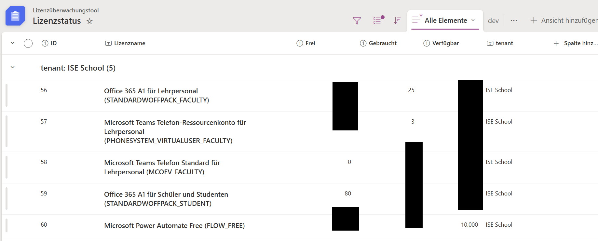
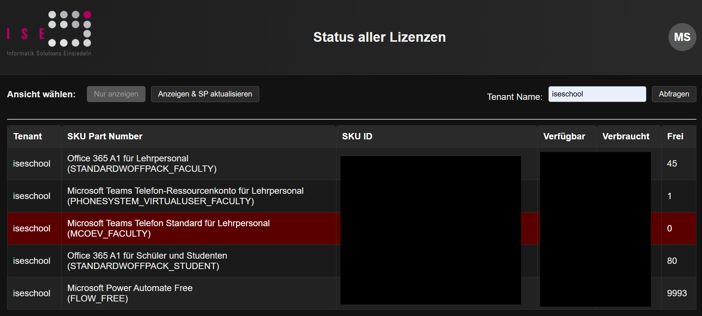
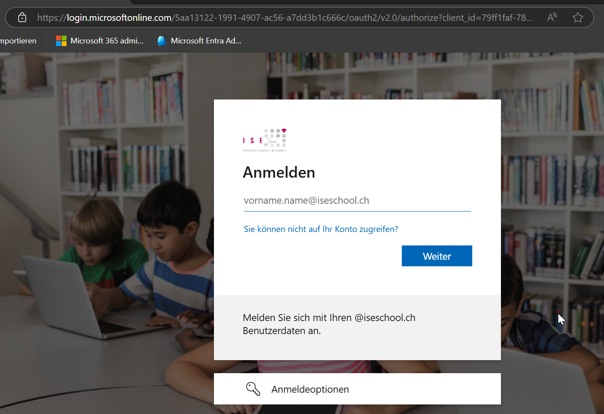

#  Kontrollieren (Control) Phase

Die Control-Phase ist der letzte Schritt im DMAIC-Zyklus eines Lean-/Six-Sigma-Projekts. Ziel dieser Phase ist es, sicherzustellen, dass die in der Improve-Phase umgesetzten Massnahmen langfristig stabil funktionieren und Rückfälle vermieden werden. In diesem Projekt steht besonders im Fokus, dass der Microservice korrekt arbeitet, kontinuierlich überwacht wird und automatisiert auf kritische Zustände reagiert.


[Quelle](../Quellverzeichnis/index.md#control-phase) 

### Ziele der Control-Phase

- Sicherstellung der Stabilität des Microservices
    
- Aktivierung von Monitoring und Logging
    
- Automatisierte Tests zur Qualitätssicherung
    
- Absicherung der PowerAutomate-Benachrichtigungen
    
- Zugriffsschutz durch Microsoft-Authentifizierung
    

---

### Kontrollmechanismen im Überblick

|Mechanismus|Beschreibung|
|---|---|
|Pytest + Coverage|Automatisierte Tests für alle Kernfunktionen|
|Logging|Ereignisse und Fehler werden zentral in einer Logdatei mit Rotation gespeichert|
|PowerAutomate|Flows erkennen Lizenzengpässe und Zertifikatsabläufe automatisch|
|Authentifizierung|Zugriff nur für eingeloggte Benutzer mit Microsoft-Konto (OAuth2)|
|Datenkonsistenzprüfung|Vergleich zwischen SQLite (lokal), SharePoint (Cloud) und Microsoft Graph API|

---

### Testautomatisierung mit Pytest

Zur Sicherstellung der Funktionsfähigkeit und Codequalität wurde `pytest` als Framework verwendet. Die Tests prüfen sowohl Standardabläufe als auch Fehler- und Sonderfälle. Die Datei `test_license.py` enthält z. B. folgende Tests:

- Abfrage aller vorhandenen Lizenzen
    
- Abfrage einer Lizenz per ID
    
- Anlegen neuer Lizenzen
    
- Anzeige von Lizenzdaten für spezifische Tenants
    
- Fehlerbehandlung bei ungültiger Konfiguration
    
- Validierung der SharePoint-Integration
    

Beispiel:

```python
def test_get_licenses(client):
    response = client.get('/api/v1/licenses/')
    assert response.status_code == 200
    assert b'Test License 1' in response.data

```

Mocking wurde eingesetzt, um die Microsoft Graph API und die SharePoint-Kommunikation zu simulieren, ohne auf echte externe Dienste angewiesen zu sein. Damit wird sichergestellt, dass auch Ausnahmefälle wie API-Fehler oder fehlende Konfigurationsdateien korrekt behandelt werden.

---

### Pytest-Testergebnisse

**Hier wird das Pytest-Ergebnis eingebunden (Screenshot):**


> Testlauf vom 06.07.2025 – ausgeführt über `pytest --cov=app test/`

| Kennzahl               | Wert                                        |
| ---------------------- | ------------------------------------------- |
| Anzahl Tests           | 32                                          |
| Davon fehlgeschlagen   | 0                                           |
| Testdauer              | ca. 1 Sekunde                               |
| Codeabdeckung          | 91 %                                        |
| Getestete Module       | routes, mggraph, auth, monitoring, frontend |
| Abdeckung aller Module | > 80%                                       |

Die Abdeckung betrifft insbesondere die kritischen Pfade in:

- `routes.py` → Endpunkte zur Anzeige und Aktualisierung von Lizenzen
    
- `mggraph.py` → Kommunikation mit Microsoft Graph und SharePoint
    
- `auth/routes.py` → Login, Session und Zugriffsschutz
    

---

### Zusammenfassung der Control-Massnahmen

| Massnahme                                  | Umgesetzt |
| ------------------------------------------ | --------- |
| Automatisierte Tests                       | ✅ Ja      |
| Testabdeckung über 90 %                    | ✅ Ja      |
| Logging mit Fehlerprotokollierung          | ✅ Ja      |
| PowerAutomate-Benachrichtigungen aktiv     | ✅ Ja      |
| Zugriff nur für autorisierte Benutzer      | ✅ Ja      |
| Datenabgleich zwischen APIs und SharePoint | ✅ Ja      |
| Abdeckung aller Module > 80%               | ✅ Ja      |

___ 

### Testmatrix – Übersicht aller geprüften Szenarien

| Test-ID                                                                 | Kategorie                      | Ziel                                                                           | Erwartetes Verhalten                                                                     |
| ----------------------------------------------------------------------- | ------------------------------ | ------------------------------------------------------------------------------ | ---------------------------------------------------------------------------------------- |
| [T01](#t01--lizenzstatus-alle-tenants-anzeigen)                         | Lizenzstatus (alle)            | Abruf aller Lizenzdaten aller Tenants über `/api/v1/licenses/status/show`      | JSON-Rückgabe mit vollständiger Lizenzübersicht                                          |
| [T02](#t02--lizenzstatus-einzelner-tenant-anzeigen)                     | Lizenzstatus (Tenant)          | Anzeige des Lizenzstatus eines einzelnen Tenants                               | Lizenzdaten korrekt für angegebenen Tenant                                               |
| [T03](#t03--lizenzstatus--sharepoint-synchronisation)                   | Lizenzstatus + SharePoint Sync | Abruf und direkte Übertragung an SharePoint über `/status/show-fetch/<tenant>` | Daten werden geholt, aufbereitet und gespeichert                                         |
| [T04](#t04--lizenzstatus-eines-tenants-anzeigen)                        | Fehlerbehandlung               | Fehlendes Config-File (z. B. falscher Tenantname)                              | Rückgabe leerer Liste, kein Absturz                                                      |
| [T05](#t05--fehler-bei-fehlender-tenant-konfiguration)                  | SharePoint Sync                | Lizenzdaten in SharePoint schreiben                                            | Einträge werden erstellt oder aktualisiert                                               |
| [T06](#t06--lizenzverarbeitung-basierend-auf-tenant-status--monitoring) | Monitoring-Steuerung           | Aktivierung/Deaktivierung von Monitoring per SharePoint                        | Nur aktive Tenants mit werden verarbeitet, Benachrichtigungen nur mit aktivem Monitoring |
| [T07](#t07--support-benachrichtigung-bei-engpass)                       | Authentifizierung              | Zugriff auf geschützte Seite ohne Login                                        | Weiterleitung zum Login-Endpoint                                                         |
| [T08](#t08--zugriff-ohne-login-auth-test)                               | Frontend-Verfügbarkeit         | Statusseiten wie `statusall.html` werden geladen                               | Seiten sind erreichbar, HTML-Code wird geliefert                                         |
| [T09](#t09--frontend-seiten-erreichbar)                                 | Graph API Fehler               | Microsoft Graph simuliert einen Fehler                                         | Fehler wird abgefangen und geloggt                                                       |
| [T10](#t10--fehlerhafte-graph-api-behandeln)                            | JSON Fehlerhandling            | Ungültiges JSON in Konfigurationsdatei                                         | Fehler wird erkannt, API liefert leere Antwort                                           |
| [T11](#t11--ungültige-json-konfiguration)                               | Coverage-Ziel                  | Codeabdeckung prüfen                                                           | Über 90 % erreicht, keine ungetesteten Kernteile                                         |

> 💡 **Hinweis:** <br> 
> Alle Tests wurden mit der `client`-Fixture aus `conftest.py` durchgeführt und durch Mocking vollständig isoliert. Damit wurde sichergestellt, dass alle APIs reproduzierbar getestet werden können – unabhängig von externer Konnektivität.


#### **T01 – Lizenzstatus: Alle Tenants anzeigen**

Testet den zentralen API-Endpunkt `/api/v1/licenses/status/show`, der alle Lizenzdaten aus sämtlichen konfigurierten Tenants abruft, verarbeitet und als konsolidierte JSON-Liste zurück liefert.

```json
[
	{
	    "available_units": 1000,
	    "consumed_units": 7,
	    "free_units": 993,
	    "skuid": "f30db892-07e9-47e9-837c-80727f46fd3d",
	    "skupartnumber": "Microsoft Power Automate Free<br>(FLOW_FREE)",
	    "tenant": "ISE School"
	},
	{
	    "available_units": 500,
	    "consumed_units": 2,
	    "free_units": 498,
	    "skuid": "f30db892-07e9-47e9-837c-80727f46fd3d",
	    "skupartnumber": "Microsoft Power Automate Free<br>(FLOW_FREE)",
	    "tenant": "ISE School 2013"
	},
	
]
```   


---

#### **T02 – Lizenzstatus: Einzelner Tenant anzeigen**

Über den Endpunkt `/api/v1/licenses/status/show/<tenant>` wird geprüft, ob der Microservice gezielt Lizenzdaten für einen bestimmten Tenant abruft und korrekt darstellt. Diese Route wird z. B. für Detailansichten im Frontend genutzt.

```json
[
  {
    "available_units": 70,
    "consumed_units": 25,
    "free_units": 45,
    "skuid": "94763226-9b3c-4e75-a931-5c89701abe66",
    "skupartnumber": "Office 365 A1 f\u00fcr Lehrpersonal<br>(STANDARDWOFFPACK_FACULTY)"
  },
  {
    "available_units": 4,
    "consumed_units": 3,
    "free_units": 1,
    "skuid": "0e142028-345e-45da-8d92-8bfd4093bbb9",
    "skupartnumber": "Microsoft Teams Telefon-Ressourcenkonto f\u00fcr Lehrpersonal<br>(PHONESYSTEM_VIRTUALUSER_FACULTY)"
  },
]
```

---

#### **T03 – Lizenzstatus + SharePoint-Synchronisation**

Testet den vollständigen Ablauf: Lizenzdaten eines Tenants werden über `/status/show-fetch/<tenant>` geladen, verarbeitet und an SharePoint übertragen. Dabei wird geprüft, ob `push_license_status_to_sharepoint()` korrekt ausgeführt wird.



> _Lizenzübersicht im SharePoint_

---

#### **T04 – Lizenzstatus eines Tenants anzeigen**

Testet `/api/v1/licenses/status/show/<tenant>`. Erwartet: JSON mit Lizenz-Infos (inkl. `available`, `consumed`, `free`).



> _Einsicht aller Lizenzen in einem Tenant_


---

#### **T05 – Fehler bei fehlender Tenant-Konfiguration**

Simuliert, dass `config-<tenant>-profile.json` fehlt. Erwartet: API gibt leeres Array zurück.


> _Leerer Array, weil das Config-Profile nicht existiert_


```output
2025-07-06 10:24:35,346 [ERROR] app.licenses.routes: Fehler beim Abrufen von Lizenzdaten für iseschool2022

Traceback (most recent call last):

  File "/app/app/licenses/routes.py", line 120, in get_license_status_tenant_show

    with open(config_file, "r") as f:

         ~~~~^^^^^^^^^^^^^^^^^^

FileNotFoundError: [Errno 2] No such file or directory: 'config-profiles/config-iseschool2022-profile.json'
```

> _Log-Output_


> _Fehleransicht, bei falsch ausgewähltem Tenant_

---

#### **T06 – Lizenzverarbeitung basierend auf Tenant-Status & Monitoring**

Dieser Test prüft die **SharePoint-gesteuerte Steuerung**, ob ein Tenant durch den Microservice verarbeitet wird. Nur wenn `enabled = true` ist, werden Lizenzdaten überhaupt abgefragt. Zusätzlich entscheidet das Feld `monitoring = true`, ob beim Lizenzengpass ein PowerAutomate-Trigger (`trigger_inform_supporter`) gesetzt wird.


> _Frontend-Verwaltung fürs Monitoring und Aktivierung der Tenants _


---

#### **T07 – Support-Benachrichtigung bei Engpass**

Prüft, ob bei `free_units = 0` ein Trigger gesetzt wird.


> _Trigger wird gesetzt wenn freie Lizenz bei 0 steht_


> _Benachrichtigung per Mail, welche via PowerAutomate versendet werden_


---

#### **T08 – Zugriff ohne Login (Auth-Test)**

Prüft Zugriff auf `/statusall` ohne Authentifizierung.



> _Solange man nicht angemeldet ist, wird eine Anmeldung verlangt und man wird auf die M365 Anmeldeseite weitergeleitet._


---

#### **T09 – Frontend-Seiten erreichbar**

Testet, ob z. B. `statusall.html` lädt.


> _Aufruf der Frontendseite `Statusall.png`_


---

#### **T10 – Fehlerhafte Graph API behandeln**

Simuliert API-Ausfall über `side_effect`.

```output
2025-07-06 12:01:18,239 [INFO] app.licenses.routes: Lade Konfiguration für Tenant: missing-tenant

2025-07-06 12:01:18,244 [ERROR] app.licenses.routes: Fehler beim Abrufen von Lizenzdaten für 'missing-tenant'

Traceback (most recent call last):

  File "/app/app/licenses/routes.py", line 211, in get_license_status_tenant_showfetch

    with open(config_file, "r") as f:

         ~~~~^^^^^^^^^^^^^^^^^^

FileNotFoundError: [Errno 2] No such file or directory: 'config-profiles/config-missing-tenant-profile.json'

2025-07-06 12:01:18,255 [INFO] werkzeug: 172.18.0.1 - - [06/Jul/2025 12:01:18] "GET /api/v1/licenses/status/show-fetch/missing-tenant HTTP/1.1" 200 -
```

> _Fehler wurde geloggt aber API ist nicht abgestürzt_

---

#### **T11 – Ungültige JSON-Konfiguration**

Testet defekte `config-*.json`.

```text

2025-07-06 12:11:25,648 [INFO] app.licenses.routes: Lade Lizenzstatus für Tenant 'missing'

2025-07-06 12:11:25,660 [ERROR] app.licenses.routes: Fehler beim Abrufen von Lizenzdaten für missing

Traceback (most recent call last):

  File "/app/app/licenses/routes.py", line 121, in get_license_status_tenant_show

    config_data = json.load(f)

  File "/usr/local/lib/python3.13/json/__init__.py", line 293, in load

    return loads(fp.read(),

        cls=cls, object_hook=object_hook,

        parse_float=parse_float, parse_int=parse_int,

        parse_constant=parse_constant, object_pairs_hook=object_pairs_hook, **kw)

  File "/usr/local/lib/python3.13/json/__init__.py", line 346, in loads

    return _default_decoder.decode(s)

           ~~~~~~~~~~~~~~~~~~~~~~~^^^

  File "/usr/local/lib/python3.13/json/decoder.py", line 345, in decode

    obj, end = self.raw_decode(s, idx=_w(s, 0).end())

               ~~~~~~~~~~~~~~~^^^^^^^^^^^^^^^^^^^^^^^

  File "/usr/local/lib/python3.13/json/decoder.py", line 361, in raw_decode

    obj, end = self.scan_once(s, idx)

               ~~~~~~~~~~~~~~^^^^^^^^

json.decoder.JSONDecodeError: Expecting ',' delimiter: line 7 column 5 (char 231)
```

> _Fehlermeldung im Log, wenn das Config-Profile nicht korrekt formatiert ist_


---

#### T12 – Codeabdeckung über 90 %

Prüft Coverage nach `pytest --cov`.


> _Pytest Auswertung alles wurde mit > 80% abgedeckt_.
> _Die Codeabdeckung beträgt > 90%_


---

### Fazit

Mit der Control-Phase wurde sichergestellt, dass der Microservice nicht nur korrekt funktioniert, sondern auch im Alltagsbetrieb zuverlässig und nachhaltig arbeitet. Die Kombination aus Tests, Monitoring, Logging und rollenbasierter Zugriffskontrolle schafft die Basis für eine sichere, wartbare und erweiterbare Lösung im produktiven Einsatz.  
Dank der umfassenden Testabdeckung kann künftige Weiterentwicklung erfolgen, ohne die Systemstabilität zu gefährden.

