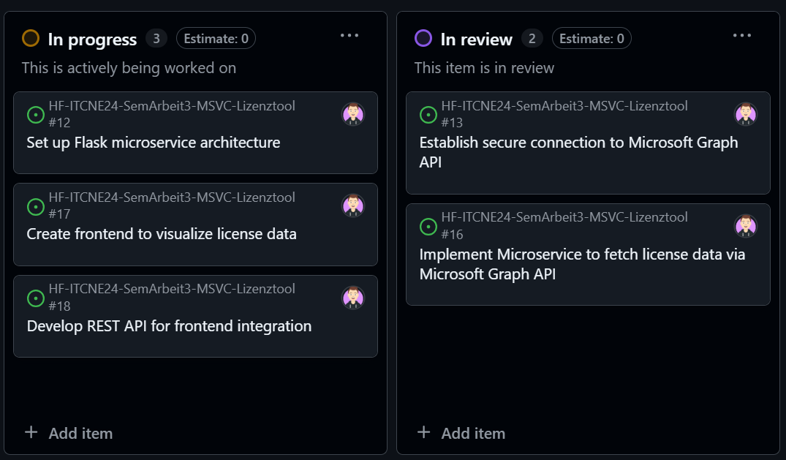

# Sprint 2 – Planning & Review

### Allgemeine Informationen

**Sprint-Zeitraum:** 09.05.2025 – 02.06.2025  
**Sprint Review:** Freitag, 02.06.2025  
**Projekt:** Lizenzüberwachungstool für die ISE AG  
**Bearbeiter:** Miguel Schneider  
**PO:** 

---
## Sprint Planning

### Sprint-Ziel
Ziel des zweiten Sprints ist es, die Einleitung der Dokumentation fertigzustellen – ein Ziel, das bereits im ersten Sprint vorgesehen war, jedoch noch nicht erreicht wurde. Darüber hinaus beginnt in diesem Sprint die praktische Umsetzung des Projekts. Dazu zählt der Aufbau des Grundgerüsts für den Flask-Service sowie die Herstellung einer funktionierenden Verbindung zur Microsoft Graph API. Ergänzend wird ein erster Entwurf für das Frontend erstellt, um die Benutzeroberfläche künftig testen und weiterentwickeln zu können.

### Dazugehörige "Userstorys"

Alle Issues im Meilenstein: [2. Sprint](https://github.com/Radball-Migi/HF-ITCNE24-SemArbeit3-MSVC-Lizenztool/milestone/2)
Zusätzlich jene welche den Status `in progress` haben. 

*Projektboard Übersicht vom 02.06.2025 (Statis: `In progress` & `In review`)* 

---
## Sprint Review 

### Erreichte Ergebnisse

- Einleitung aus Sprint 1 wurde fertig geschrieben. 
- Das Grundgerüst für den Flaskservice wurde erstellt, mit Blueprints, wie im Unterricht gelernt. 
- Die Verbingung mit MG-Graph wurde mittels App-Registrierung gesichert, erstellt und getestet. 
- Ein erster API Abruf konnte mittels Flaskservice abgesetzt werden und alle Lizenzen aus dem Tenant wurden angezeigt. 
- Ein erster versuch mit den Templates, für das Frontend wurde gemacht und funktioniert. 
- Ein Script wurde erstellt um die Zertifikate für einen neuen Tenant (für die Abfrage) zu erstellen und die Infos im einem JSON abzuspeichern. 

### Nicht erreichte Ziele

- Dokumentation aktuell halten

### Risiko Bewertung

| Risiko                                                                 | Eintritt | Auswirkung | Massnahme zur Vermeidung / Minderung                                                   |
|------------------------------------------------------------------------|----------|------------|----------------------------------------------------------------------------------------|
| Zeitverzögerung durch technisches Debugging oder fehlendes Know-how   | Hoch     | Mittel     | Zeitpuffer einplanen, Fokus auf MVP, Probleme frühzeitig angehen                     |
| Fehlerhafte oder unvollständige API-Abfragen (Graph API)              | Mittel   | Hoch       | Ausgiebig mit Testdaten prüfen, Logging & Fehlerbehandlung implementieren            |
| SharePoint-Zugriffsprobleme (z. B. Berechtigungen, API-Limits)        | Mittel   | Mittel     | Rechte und Zugriff frühzeitig testen, Alternativlösung vorbereiten                   |
| Power Automate Benachrichtigungen funktionieren nicht zuverlässig     | Niedrig  | Hoch       | Flows früh einrichten, mit Testfällen absichern, manuelle Kontrolle ergänzen         |
| GitHub-Dokumentation wird nicht laufend gepflegt                      | Niedrig  | Niedrig    | Doku fix in Workflow einplanen, regelmässige Erinnerung im Taskboard                 |

Das im Risikomanagement identifizierte Risiko einer unvollständig gepflegten Projektdokumentation hat sich im Verlauf des zweiten Sprints bestätigt. Der Fokus lag stark auf der technischen Umsetzung, insbesondere auf der Erstellung eines funktionierenden Grundgerüsts für den Flask-Service. Gemäss dem Pareto-Prinzip (80/20-Regel) wurde bewusst priorisiert, mit gezielten 20 % des Aufwands einen möglichst grossen Fortschritt zu erzielen – in diesem Fall die erfolgreiche Anbindung an Microsoft Graph und die erste Version des Frontends. Die Dokumentation soll im weiteren Projektverlauf gezielt ergänzt und laufend aktualisiert werden.
### Erkenntnisse / Retrospektive

- Gut lief die technische Umsetzung des Flask-Backends. Die Grundstruktur wurde erfolgreich erstellt und die Verbindung zur Microsoft Graph API funktioniert wie geplant. Auch erste Tests im Frontend konnten durchgeführt werden, wodurch das Projekt erstmals in Interaktion trat.

- Herausfordernd war, dass die Dokumentation im Vergleich zum ersten Sprint etwas in den Hintergrund rückte. Der Fokus lag stark auf der Funktionalität (Paretoprinzip), was zwar sinnvoll war, aber dazu führte, dass das Risiko einer vernachlässigten Doku – wie bereits im Risikoformular identifiziert – eingetreten ist. Zudem war die initiale Einbindung der Authentifizierung aufwändiger als gedacht, da mehrere Fehlermeldungen zur Tokenverarbeitung analysiert werden mussten.

- Für den nächsten Sprint möchte ich gezielter Zeit für die Dokumentation einplanen. Zusätzlich sollen die Frontend-Komponenten verbessert und klarer strukturiert werden. Darüber hinaus wird die Anbindung der Datenspeicherung im SharePoint sowie das Monitoring mittels Power Automate in Angriff genommen.

---
## Projektanpassungen
Während des Sprints wurde in Absprache mit dem Experten, am 14.05.2025, der Funktionsumfang des Projekts erweitert. Das Monitoring über PowerAutomate soll zusätzlich über das Frontend steuerbar sein.  
Konkret wird ein zusätzliches Steuerungsfeld in der SharePoint-Liste integriert, das von PowerAutomate ausgelesen wird.  
Dadurch lässt sich flexibel festlegen, ob ein bestimmter Datensatz überwacht werden soll. Diese Anpassung erhöht die Benutzerkontrolle und verhindert unnötige Benachrichtigungen.  
Das dazugehörige Issue wurde im Projektplan zusätzlich erstellt: [Control PowerAutomate Monitoring via Frontend · Issue #22 · Radball-Migi/HF-ITCNE24-SemArbeit3-MSVC-Lizenztool](https://github.com/Radball-Migi/HF-ITCNE24-SemArbeit3-MSVC-Lizenztool/issues/22) 

---

## Nächstes Sprintziel (Sprint 3, 20.06.2025 – Vorschau)

1. Anbindung SharePoint und Monitoring PowerAutomate
2. Frontend verbessern
3. Fertigstellung des Microservice
4. Projektdokumentation aktualisieren