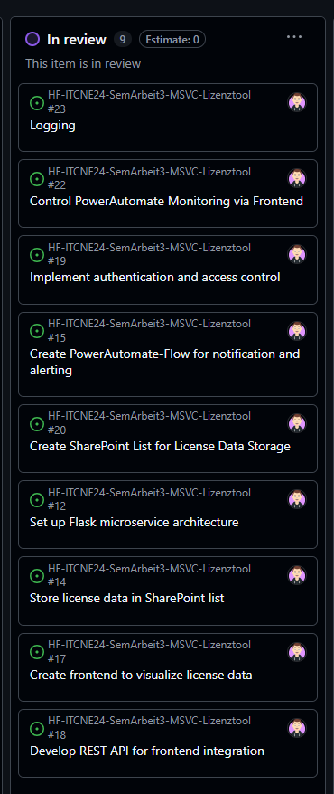
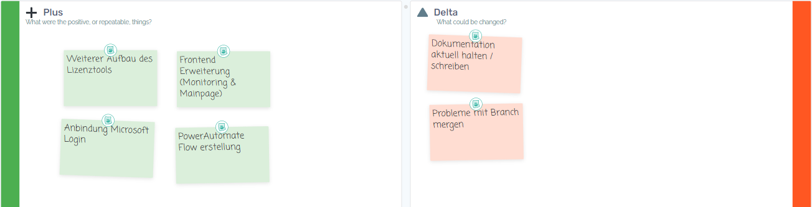

# Sprint 3 – Planning & Review

### Allgemeine Informationen

**Sprint-Zeitraum:** 02.06.2025 – 20.06.2025  
**Sprint Review:** Freitag, 20.06.2025  
**Projekt:** Lizenzüberwachungstool für die ISE AG  
**Bearbeiter:** Miguel Schneider  
**PO:** 

---
## Sprint Planning

### Sprint-Ziel
Ziel des dritten Sprints ist die Fertigstellung des Lizenz-Tools in seiner Kernfunktionalität. Der Fokus liegt auf dem finalen Ausbau der bestehenden Funktionen, der Behebung verbleibender Fehler sowie auf ersten internen Tests zur Sicherstellung der grundlegenden Funktionsfähigkeit. Darüber hinaus wird die Dokumentation um die Beschreibung der technischen Umsetzung ergänzt, um den Entwicklungsfortschritt transparent darzustellen und eine solide Basis für die abschliessende Optimierung im nächsten Sprint zu schaffen.

### Dazugehörige "Userstorys"

Alle Issues im Meilenstein: [3. Sprint](https://github.com/Radball-Migi/HF-ITCNE24-SemArbeit3-MSVC-Lizenztool/milestone/3)

*Projektboard Übersicht vom 20.06.2025* 

---
## Sprint Review 

### Erreichte Ergebnisse

- Fertigstellung des Lizenztools
- Lizenztool mit Microsoft Authentication ausgestattet
- Logging eingebunden

### Nicht erreichte Ziele

- Dokumentation aktuell halten

### Risiko Bewertung

| Risiko                                                                 | Eintritt | Auswirkung | Massnahme zur Vermeidung / Minderung                                                   |
|------------------------------------------------------------------------|----------|------------|----------------------------------------------------------------------------------------|
| Zeitverzögerung durch technisches Debugging oder fehlendes Know-how   | Hoch     | Mittel     | Zeitpuffer einplanen, Fokus auf MVP, Probleme frühzeitig angehen                     |
| Fehlerhafte oder unvollständige API-Abfragen (Graph API)              | Mittel   | Hoch       | Ausgiebig mit Testdaten prüfen, Logging & Fehlerbehandlung implementieren            |
| SharePoint-Zugriffsprobleme (z. B. Berechtigungen, API-Limits)        | Mittel   | Mittel     | Rechte und Zugriff frühzeitig testen, Alternativlösung vorbereiten                   |
| Power Automate Benachrichtigungen funktionieren nicht zuverlässig     | Niedrig  | Hoch       | Flows früh einrichten, mit Testfällen absichern, manuelle Kontrolle ergänzen         |
| GitHub-Dokumentation wird nicht laufend gepflegt                      | Niedrig  | Niedrig    | Doku fix in Workflow einplanen, regelmässige Erinnerung im Taskboard                 |

Das im Risikomanagement frühzeitig erkannte Risiko einer unvollständig gepflegten Projektdokumentation hat sich im Verlauf des dritten Sprints weiter bestätigt. Aufgrund der intensiven Fokussierung auf die technische Umsetzung blieb für die Pflege und den Ausbau der Dokumentation nur begrenzt Zeit. Der Hauptfokus dieses Sprints lag auf der Fertigstellung des Lizenztools, das in Kombination mit dem zugehörigen Frontend erfolgreich umgesetzt wurde. Damit wurde ein wesentlicher Meilenstein im Projekt erreicht, auch wenn der dokumentarische Rückstand im nächsten Sprint gezielt aufgeholt werden muss, um die Nachvollziehbarkeit und Wartbarkeit des Projekts langfristig zu gewährleisten.

### Erkenntnisse / Retrospektive

---
## Nächstes Sprintziel (Abgabe - Vorschau)

1. Dokumentation fertig stellen
2. Bugfixing
3. Präsentation vorbereiten
4. Abgabe des Projekts

## Fragen an Experten
- Dokumentation (Nicht zu viel Text, was wird darunter gemeint?)